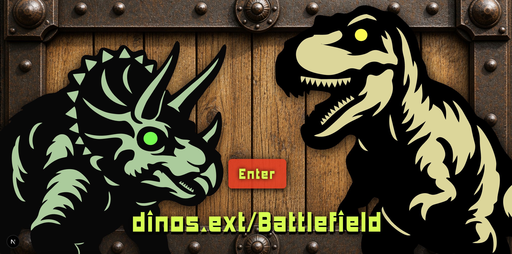

# ⚔️ dinos.ext / Battlefield

<p align="center">
  
  
</p>

**🤖 Live Demo → [dinos.ext/Battlefield](https://dinos.ht55.dev)**

---

## Overview

**dinos.ext/Battlefield** is a multi-agent debate platform that pits two frontier language models — Grok and Claude — against each other in real-time, structured argumentation. It evolved from [Thalasscope](https://github.com/ht55/Thalasscope), an earlier system built around visualizing and storing the reasoning differences between Claude Haiku and Sonnet. Where Thalasscope prioritized observation and data, Battlefield takes the opposite approach: volatile sessions, no storage, and a human embedded directly into the agent graph as an active third agent.

Each session runs as a stateful LangGraph graph with the user positioned as an active third agent, not a passive observer. The user controls session flow, can inject interventions at any round, and is the sole arbiter of when the debate concludes.

There is no judge, no automatic verdict, and no persistent state by design.

---

## Battle Modes

| Mode | Claude | Grok | Best for |
|------|--------|------|----------|
| ⚔️ **Ultimate Showdown** | Opus 4.6 | Grok 4.3 | Maximum depth, frontier reasoning |
| ⚡ **Quick Sparring** | Haiku 4.5 | Grok 4.1 Fast | Fast iterations, casual topics |

---

## How to Play

1. Enter any topic — serious, absurd, or somewhere between
2. Watch **Round 1: Opening Claims** — both models argue independently, in parallel, with no visibility into each other's output
3. After each round, choose your next move:

| Action | What it does |
|--------|-------------|
| **CONTINUE** | Trigger the next exchange |
| **INTERVENE** | Insert your own critique, hint, or counter-argument directed at either or both models |
| **ROLESWAP** | Force them to swap positions and defend what they were just attacking |
| **END** | Stop the debate and see the summary |

4. The debate runs until you press END — no fixed round limit

---

## What You'll See

**Attack Strategy Preview** — before each rebuttal, each model's attack target is disclosed. You see what they're aiming at before the strike lands.

**Belief Update & Tenacity Tracking** — after each round, confidence levels shift and position changes are classified:
- ⚡ `legitimate_reconstruction` — argument genuinely rebuilt under valid critique
- 👻 `topic_shift` — subject quietly changed to escape the attack
- 📚 `authority_escape` — retreated to citing authority rather than reasoning through
- 🎭 `emotional_reframe` — logic replaced with rhetorical or emotional language

**Argument Structure** — every claim is parsed into premises, reasoning steps, and conclusion. The logical skeleton is always visible.

**Debate Summary** — a final summary on session end, comparing confidence trajectories and tenacity patterns across all rounds.

---

## Architecture Decisions

**Parallel API calls with information isolation**  
Opening claims are generated via simultaneous, independent API calls. Neither model sees the other's argument before generating its own. This is a deliberate design choice — genuine disagreement requires genuine independence. Feeding one model's output to the other before generation would bias the framing from round one.

**User as a first-class graph node**  
The session is managed as a LangGraph state machine with `interrupt_before=["user_turn"]`. Rather than treating user input as an external trigger, the user is structurally embedded in the graph as the third agent. The graph cannot advance without an explicit user action — continue, intervene, roleswap, or end.

**Separated confidence signals**  
Each model self-reports a `confidence_delta` per round. A separate `belief_updater` node independently analyzes the exchange and assigns tenacity scores and classifications. The two signals are intentionally decoupled: self-assessment and external observation measure different things and should not be collapsed into one.

**Structured outputs enforced at the API level**  
All agent responses are JSON-schema-enforced. This prevents parse failures from propagating to the UI and ensures consistent rendering of argument structure, attack targets, and confidence values across rounds.

**Volatile by design**  
No database. No session persistence. MemorySaver is used for in-graph checkpointing only, scoped to the active session. This is not a cost optimization — it is a product decision. Storing conclusions would imply the debate produced something definitive. It does not.

**Unlimited rounds with a soft ceiling**  
There is no `max_rounds` constraint in the graph. A warning dialog appears after 20 rounds, but the user retains full control. Imposing a hard limit would contradict the premise that debate is an ongoing process with no natural termination point.

---

## Topic Categories

The system automatically classifies the input topic and adapts the debate rules accordingly:

| Category | Examples | Behavior |
|----------|----------|----------|
| **Factual** | "What's the current state of quantum computing?" | Evidence burden enforced, temporal limitations acknowledged |
| **Scientific** | "Will quantum computers break encryption?" | Explicit premise chains required, uncertainty must be quantified |
| **Controversial** | "Is capital punishment justified?" | Positions forcibly assigned, ethical escape routes blocked |
| **Philosophical** | "Does free will exist?" | Terms must be defined before use, intuition flagged as such |

---

## Tech Stack

| Layer | Tech |
|-------|------|
| Frontend | Next.js + React (Vercel) |
| Backend | FastAPI + LangGraph (Railway) |
| Streaming | Server-Sent Events (SSE) |
| Claude | Anthropic API — Opus 4.6 / Haiku 4.5 |
| Grok | xAI API (OpenAI-compatible) — Grok 4.3 / Grok 4.1 Fast |
| Database | None — volatile by design |

**BYOK** — API keys (Anthropic + xAI) are entered by the user at runtime via the UI. No server-side key configuration is required.

---

## Running Locally

```bash
# Backend
cd backend
pip install -r requirements.txt
uvicorn main:app --reload

# Frontend
cd frontend
npm install
npm run dev
```

```env
# backend/.env
FRONTEND_URL=http://localhost:3000
```

---

## What's Intentionally Missing

**Automatic winner declaration**  
In many multi-agent systems, a strong "judge" agent collapses the outputs of other agents into a single verdict — and in doing so, introduces its own bias into what the user ultimately receives. The user sees the conclusion, not the reasoning that was overridden to get there. Here, AI handles the heavy lifting of argumentation: constructing claims, parsing opponent logic, tracking belief shifts. But judgment is deliberately left to the human. Not as a philosophical statement — as a practical one. No agent is a more accurate judge of what *you* should conclude than you are.

| Feature | Reason removed |
|---------|----------------|
| Fixed round limits | Debate has no natural termination point; the user decides |
| Fallacy detector (GPT-4) | Redundant with tenacity tracking; undermines the user's analytical role |
| Auto mode | Observation and participation should not require a mode switch |
| Saved debate history | Volatility is a feature — conclusions are the user's to hold, not the system's to store |

---

## License

MIT

---

* Made with intellectual violence and love for good arguments.
* Try a controversial or unsolvable topic. Things get heated fast — and defeating both AIs simultaneously is kind of fun lol.
